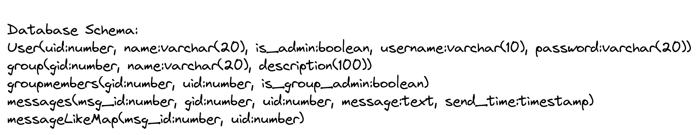
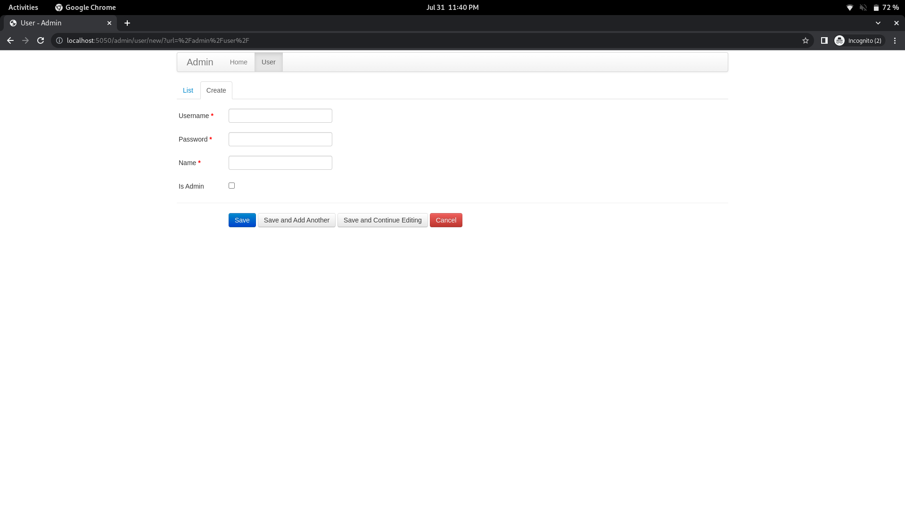
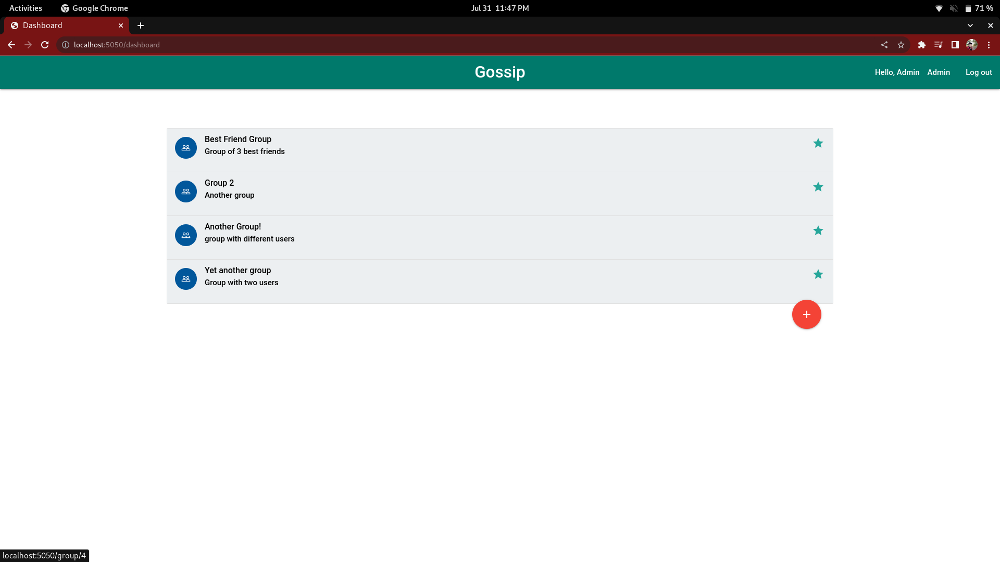
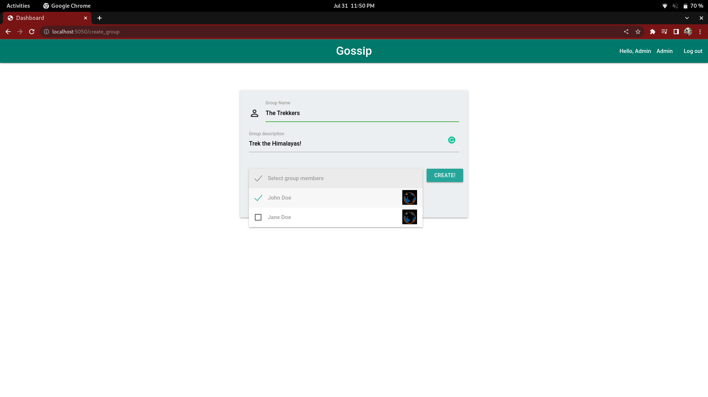
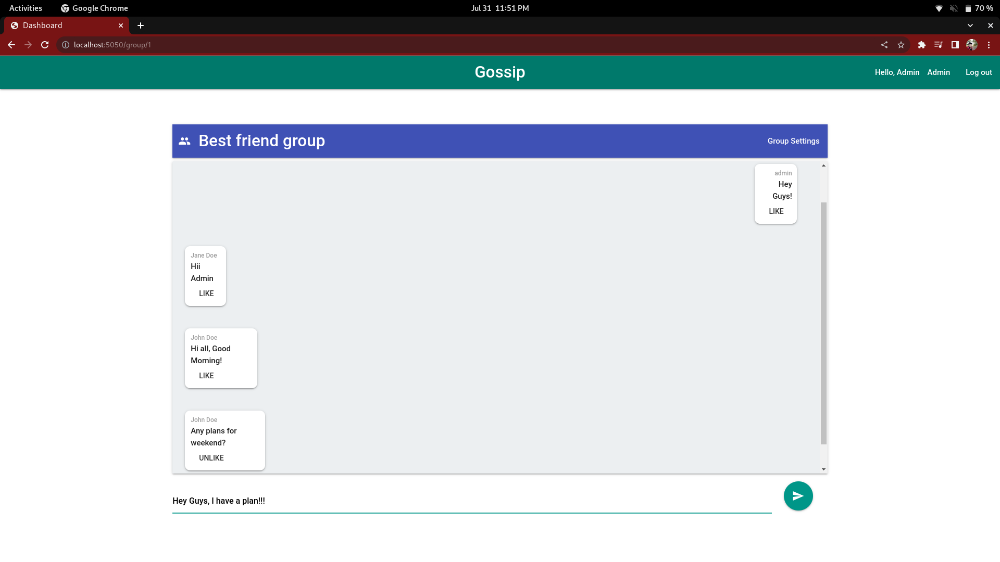
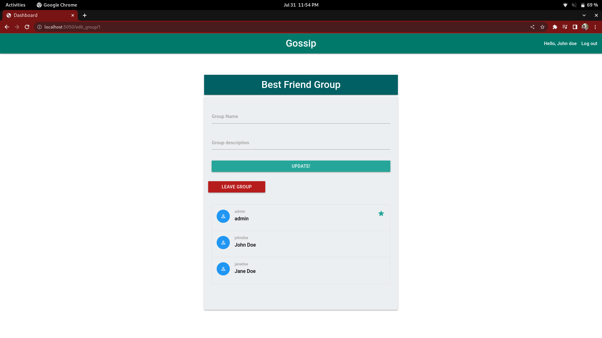
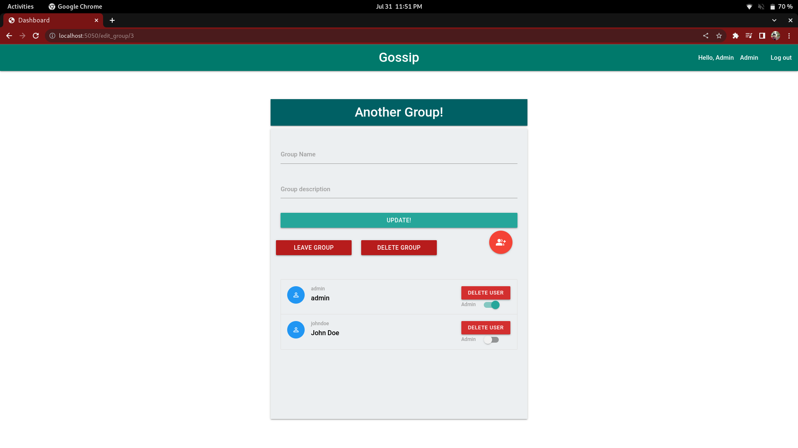
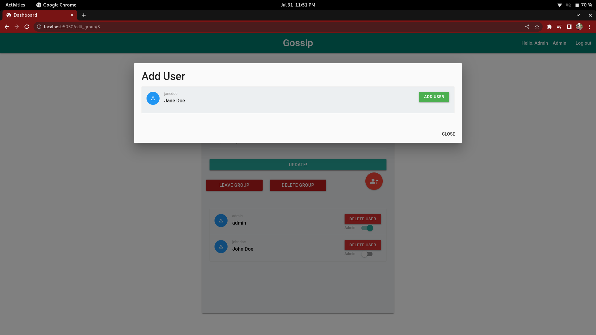

# 1. Gossip: a group chat app 
Gossip is a group chat app written in python using flask framework.  
This application makes use of following flask plugins and features

- Flask-SqlAlchemy
- Flask-admin
- Flask sessions
- Flask unittests
- Flask Jinja2 templates

For database we have used sqlite db and following is the schema of database



We have following pages as a pert of project


# Admin Page

Among the above pages, we have leveraged flask-admin plugin for setting up admin page which provides a way to create new users for the application.
This page can be accessed by accessing following URL 
```
localhost:5050/admin
```
Following is the screenshot of add user(Admin) page


# Main page (Dashboard)

This page lists all the group that current user is part of.  
Additionally this page contain a button which allows creation of new group and which redirects user to new group page



# Create Group Page

This provides a way to create new group, It takes group name and description as an input and also we can select multiple members in the group  



# Group Chat page.

This is the main page where all the action happens. :)  
Users can chat and their messages are displayed where user can send their messages



# Group settings page.

This page provides modification of group name and description.  
Also user has option to perform following operations

- Modify group name
- Modify group description
- leave group

Additionally if a user is group admin(Which is different than admin user)  
then user has following options visible on group settings page

- Add a user to group
- Delete a group member from group
- Make any member group-admin
- Remove group admin privilege from any existing group-admin user
- Delete a group

Following is screenshot for group setting page for a normal non-group-admin user



following is screenshot for group settings page for a group-admin user



Group-admin can add users using following page.



# Project Setup

1. Clone this repo
2. install python dependencies
```
python3 -m pip3 install -r requirements.txt 
```
3. Execute run.py on top directory
```
yoda@geek /mnt/workspace/git/group-chat $ python run.py 
 * Serving Flask app 'chat_app' (lazy loading)
 * Environment: production
   WARNING: This is a development server. Do not use it in a production deployment.
   Use a production WSGI server instead.
 * Debug mode: on
 * Running on all addresses (0.0.0.0)
   WARNING: This is a development server. Do not use it in a production deployment.
 * Running on http://127.0.0.1:5050
 * Running on http://192.168.1.11:5050 (Press CTRL+C to quit)
 * Restarting with stat
 * Debugger is active!
 * Debugger PIN: 137-553-965
```
If you see above message, it means setup is ready, you can open localhost:5050 from local machine.

# Executing unittests

naviage to test directory  
```cd ./chat_app/tests/```
Execute following test command
```
python3 test.py
```
```
output:
yoda@geek /mnt/workspace/git/group-chat/chat_app/tests $ python3 test.py 
...........
----------------------------------------------------------------------
Ran 11 tests in 0.715s

OK
```

# Default Users